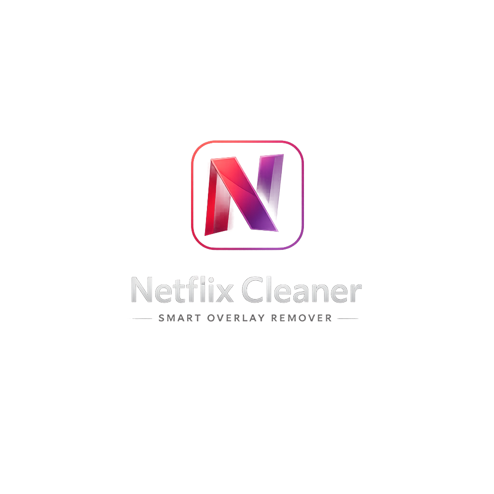

# Netflix Cleaner

Netflix Cleaner améliore l'expérience de lecture sur Netflix en masquant automatiquement les overlays et messages d'interface intrusifs (popups, suggestions, badges). Léger, local et simple à utiliser.

---

## Capture d'écran

> Ajoute tes captures d'écran dans le dossier `screenshots/` (ex : `screenshots/screenshot-1.png`).

---

## Fonctionnalités

- Masquage automatique des overlays gênants
- Activation / désactivation rapide via popup
- État persistant stocké avec `chrome.storage.local`
- Ne collecte ni n'envoie de données externes

## Installation (mode développeur)

1. Ouvrir `chrome://extensions/` et activer "Mode développeur".
2. Cliquer sur `Charger l'extension non empaquetée`.
3. Sélectionner le dossier du projet (celui contenant `manifest.json`).
4. Ouvrir une page Netflix pour vérifier le comportement.

## Utilisation

- Cliquer sur l'icône de l'extension dans la barre d'outils.
- Utiliser le toggle pour activer ou désactiver le nettoyage en temps réel.
- Le point d'état et le texte indiquent si l'extension est active (`Active`) ou désactivée (`Disabled`).

## Limitations importantes

Cette extension agit uniquement sur l'interface (DOM) : elle masque ou retire des éléments visuels pour réduire les distractions.

Elle **ne modifie pas** l'authentification, les politiques d'accès ou les contrôles de compte. Si Netflix affiche un message du type "Your device isn't part of the household", cela signifie une restriction liée au compte ou à l'appareil — Netflix doit être contacté ou les paramètres de compte doivent être ajustés pour résoudre ce type de blocage.

## Personnalisation

Tu peux adapter les règles de nettoyage dans `content.js` : ajoute ou affine les sélecteurs CSS ciblant les overlays.

## Contribution

Les contributions sont bienvenues — ouvre une issue pour signaler un overlay non supprimé ou une pull request avec une amélioration.

## Licence

Ce projet est fourni sous licence MIT. Ajoute un fichier `LICENSE` si tu veux publier sous cette licence.
